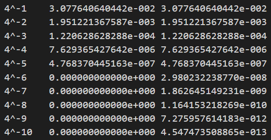
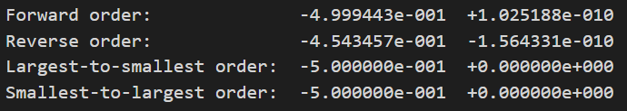

# 数值代数实验报告（Lab #1）

## 问题 1

> Write and execute a program to compute
> $$
> f(x) = \sqrt {x^2 + 1}  - 1 \\
> g(x) = \frac {x^2} {\sqrt {x^2 + 1}  + 1}
> $$
> for a succession of values of $x$, such as $4^{-1}, 4^{-2}, 4^{-3}, 4^{-4}, 4^{-5},4^{-6},4^{-7},4^{-8},4^{-9},4^{-10}$.
>
> Although $f(x)=g(x)$,  the computer produces different results. Please PRINT OUT all your numerical results with 12-digit mantissa (e.g., 0.############e-001).  Which results are reliable and which are not? 

### 编程结果如下：

用 lab1-1 程序（利用单精度浮点数，即 float 型）编程计算，计算结果均采用科学计数法保留 12 位小数，x 取如上 10 个值时得到结果如下：

| x     | (x^2+1)^0.5-1       | (x^2)/((x^2+1)^0.5+1) |
| ----- | ------------------- | --------------------- |
| 4^-1  | 3.077640640442e-002 | 3.077640640442e-002   |
| 4^-2  | 1.951221367587e-003 | 1.951221367587e-003   |
| 4^-3  | 1.220628628288e-004 | 1.220628628288e-004   |
| 4^-4  | 7.629365427642e-006 | 7.629365427642e-006   |
| 4^-5  | 4.768370445163e-007 | 4.768370445163e-007   |
| 4^-6  | 0.000000000000e+000 | 2.980232238770e-008   |
| 4^-7  | 0.000000000000e+000 | 1.862645149231e-009   |
| 4^-8  | 0.000000000000e+000 | 1.164153218269e-010   |
| 4^-9  | 0.000000000000e+000 | 7.275957614183e-012   |
| 4^-10 | 0.000000000000e+000 | 4.547473508865e-013   |

### 结果分析 ：

在 $x$ 较大时，两个函数得到的值相同，但是在 $x$ 较小时，$f$ 得到的结果为 0 ， $g$ 任能得到结果。

虽然两个函数 $f, g$ 相等，但是由于单精度浮点数的限制在计算机中得到了不同的结果。
其中 $f$ 在后面 5 个值中均为 0。 这是因为当 x 较小时，$\sqrt{x^2 + 1}$ 与 $x$ 几乎相等，它们相减导致了有效位数的丢失；
而 $g$ 通过变换形式，避免了几乎相等量的减法，从而避免了有效位数的丢失。

所以，在计算机中用单精度进行计算时用 $g$ 来编程计算更合理。

## 问题 2

> 一个有趣的数值实验是计算下面两个向量的数量积：
>
> x=(2.718281828,-3.141592654,1.414213562,0.5772156649,0.3010299957)
> y=(1486.2497,878366.9879,-22.37492,4773714.647,0.000185049)
>
> 按照正序、反序、最大-最小序、最小-最大序，四种不同的方式对分量求和，并
> 且既使用单精度又使用双精度，将八个结果与正确值作比较，并做解释。

### 编程计算结果如下：

用 lab1-2 程序编程计算，计算结果均采用科学计数法保留 7 位有效数字（即 6 位小数），分别用四种不同的方式及单双精度得到结果如下：

| order                      | 单精度(float)  | 双精度(double) |
| -------------------------- | -------------- | -------------- |
| Forward order:             | -4.999443e-001 | +1.025188e-010 |
| Reverse order:             | -4.543457e-001 | -1.564331e-010 |
| Largest-to-smallest order: | -5.000000e-001 | +0.000000e+000 |
| Smallest-to-largest order: | -5.000000e-001 | +0.000000e+000 |

### 结果分析：

将结果与精确值 : -1.006571e-011 相比较发现，计算结果均有偏差。单精度浮点数（float）计算得到的结果误差较大；双精度浮点数（double）计算得到结果相对单精度结果误差较小，前两次绝对误差在 1e-010 左右。四种方式中正向与反向结果不同，最大-最小序、最小-最大序得到结果相同，其中双精度结果为 0 。

计算误差主要来源于舍入误差，双精度浮点数舍入误差较小，因此得到结果误差较小。但是由于准确值本身非常小，所以相对误差都很大。正向与反向结果不同，可能原因是相加的顺序不同导致舍入产生的误差不同。最大-最小序与最小-最大序结果相同表示，可能原因是两个较大几乎相等量的减法导致有效位数的丢失，而且有舍入误差导致结果不准确。