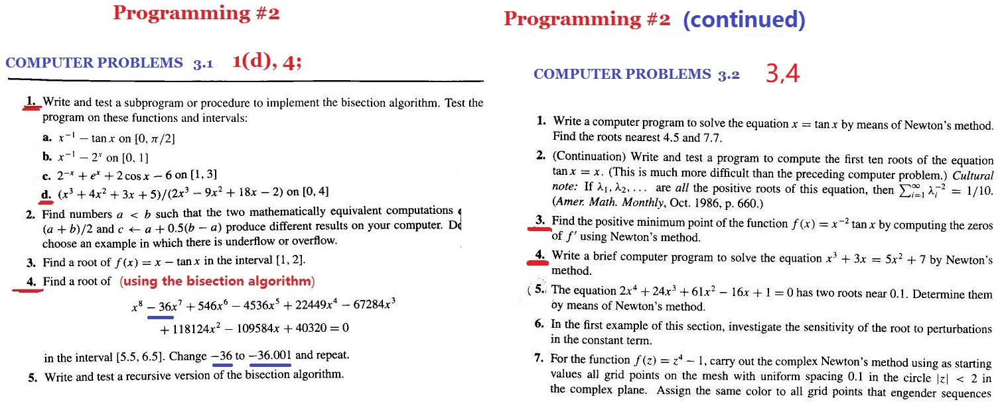
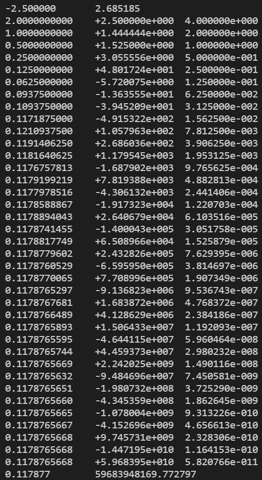
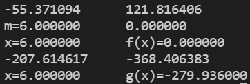
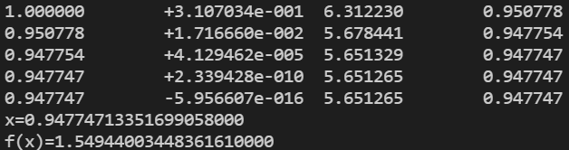
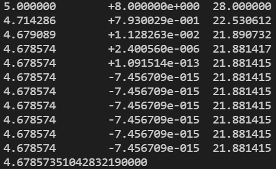

# 数值代数实验报告（Lab #2）

PB19000236 罗备文

## 问题 1

> 编写且测试一个执行对分算法的子程序或者过程，对下列函数和区间测试程序：
> $$
> f(x)=\frac{x^3+4x^2+3x+5}{2x^3−9x^2+18x-2}
> $$
> 在区间 $[0,4]$ 上

### 编程结果如下：

用 lab2-1 程序编程，用对分算法以 $\delta=1e-10, \epsilon=1e-10$ 计算，用双精度得到结果如下：

$f(0)=-2.5,f(4)=2.685185...$

| x            | f(x)           | 区间长度      |
| ------------ | -------------- | ------------- |
| 2.0000000000 | +2.500000e+000 | 4.000000e+000 |
| 1.0000000000 | +1.444444e+000 | 2.000000e+000 |
| 0.5000000000 | +1.525000e+000 | 1.000000e+000 |
| 0.2500000000 | +3.055556e+000 | 5.000000e-001 |
| 0.1250000000 | +4.801724e+001 | 2.500000e-001 |
| 0.0625000000 | -5.720075e+000 | 1.250000e-001 |
| 0.0937500000 | -1.363555e+001 | 6.250000e-002 |
| 0.1093750000 | -3.945209e+001 | 3.125000e-002 |
| 0.1171875000 | -4.915322e+002 | 1.562500e-002 |
| 0.1210937500 | +1.057963e+002 | 7.812500e-003 |
| 0.1191406250 | +2.686036e+002 | 3.906250e-003 |
| 0.1181640625 | +1.179545e+003 | 1.953125e-003 |
| 0.1176757813 | -1.687902e+003 | 9.765625e-004 |
| 0.1179199219 | +7.819388e+003 | 4.882813e-004 |
| 0.1177978516 | -4.306132e+003 | 2.441406e-004 |
| 0.1178588867 | -1.917323e+004 | 1.220703e-004 |
| 0.1178894043 | +2.640679e+004 | 6.103516e-005 |
| 0.1178741455 | -1.400043e+005 | 3.051758e-005 |
| 0.1178817749 | +6.508966e+004 | 1.525879e-005 |
| 0.1178779602 | +2.432826e+005 | 7.629395e-006 |
| 0.1178760529 | -6.595950e+005 | 3.814697e-006 |
| 0.1178770065 | +7.708996e+005 | 1.907349e-006 |
| 0.1178765297 | -9.136823e+006 | 9.536743e-007 |
| 0.1178767681 | +1.683872e+006 | 4.768372e-007 |
| 0.1178766489 | +4.128629e+006 | 2.384186e-007 |
| 0.1178765893 | +1.506433e+007 | 1.192093e-007 |
| 0.1178765595 | -4.644115e+007 | 5.960464e-008 |
| 0.1178765744 | +4.459373e+007 | 2.980232e-008 |
| 0.1178765669 | +2.242025e+009 | 1.490116e-008 |
| 0.1178765632 | -9.484696e+007 | 7.450581e-009 |
| 0.1178765651 | -1.980732e+008 | 3.725290e-009 |
| 0.1178765660 | -4.345359e+008 | 1.862645e-009 |
| 0.1178765665 | -1.078004e+009 | 9.313226e-010 |
| 0.1178765667 | -4.152696e+009 | 4.656613e-010 |
| 0.1178765668 | +9.745731e+009 | 2.328306e-010 |
| 0.1178765668 | -1.447195e+010 | 1.164153e-010 |
| 0.1178765668 | +5.968395e+010 | 5.820766e-011 |

### 结果分析 ：

区间长度小于 $\epsilon$ 时迭代终止，此时 $x=0.121094,f(x)=105.796323$，显然不是零点。

这是由于函数 f 没有零点，函数的分子没有零点，分母在区间 $[0,4]$ 上有零点，因此即使函数 f 在区间 $[0,4]$ 的端点上取值符号相反，对分算法无法找出函数的零点。

即使区间长度再小，函数值 $f(x)$ 也不会趋向于 0，反而会趋向于无穷。

这体现了二分法的局限性。

## 问题 2

> 求：
>
> $x^8 − 36x^7 + 546x^6 − 4536x^5 + 22449x^4 − 67284x^3 + 118124x^2 − 109584x + 40320 = 0$
>
> 在区间 $[5.5,6.5]$ 内的根。把 $-36$ 改为 $-36.001$ ，再重做。

### 编程计算结果如下：

用 lab2-2 程序编程用对分算法计算，计算结果保留 7 位有效数字（即 6 位小数），用双精度得到结果如下：

### 结果分析：

原方程的根为 6 ，把 $-36$ 改为 $-36.001$ 后，算法无法求出方程的根。

系数改变造成的取值偏差大概是：6^7 × 0.001 = 279.93

由于系数的微扰，导致方程左端在区间 $[5.5,6.5]$ 内取值均为负数，方程无实根，不满足二分法初始条件，因此无法求出方程的根。

## 问题3

> 通过使用牛顿法计算 $f'$ 的零点来求函数 $f(x)=x^{−2}\tan(x)$ 的最小值.

可以看出， $f'(x)$ 的零点在区间 $[0.5,1.5]$ 内，

### 编程结果如下：

用 lab2-3 程序编程，用牛顿法从 $x_0=1$ 开始以 $\delta=1e-15, \epsilon=1e-15$ 计算 $f'(x)$ 的零点，得到结果如下：

| x        | f'(x)          | f''(x)   | y        |
| -------- | -------------- | -------- | -------- |
| 1.000000 | +3.107034e-001 | 6.312230 | 0.950778 |
| 0.950778 | +1.716660e-002 | 5.678441 | 0.947754 |
| 0.947754 | +4.129462e-005 | 5.651329 | 0.947747 |
| 0.947747 | +2.339428e-010 | 5.651265 | 0.947747 |
| 0.947747 | -5.956607e-016 | 5.651265 | 0.947747 |

### 结果分析：

利用牛顿迭代法得到  $f'(x)$ 的零点 $x$ 约为 0.947747， f 的最小值在 x 处取到 $f_{min}(x)$ 约为 1.549440 这一结果相当准确。

$f'(x)$ 的误差小于10^−15，仅迭代了5次，这体现了牛顿法的二次收敛速度之快！

## 问题4

> 编写一个用牛顿法解方程 $x^2 +3x=5x^2+7$ 的简短计算机程序，从 $x_0=5$ 开始，计算 $10$ 步.

### 编程结果如下：

用 lab2-4 程序编程，用牛顿法从 $x_0=5$ 开始计算 $10$ 步，得到结果如下：

| x        | f(x)           | f'(x)     |
| -------- | -------------- | --------- |
| 5.000000 | +8.000000e+000 | 28.000000 |
| 4.714286 | +7.930029e-001 | 22.530612 |
| 4.679089 | +1.128263e-002 | 21.890732 |
| 4.678574 | +2.400560e-006 | 21.881417 |
| 4.678574 | +1.091514e-013 | 21.881415 |
| 4.678574 | -7.456709e-015 | 21.881415 |
| 4.678574 | -7.456709e-015 | 21.881415 |
| 4.678574 | -7.456709e-015 | 21.881415 |
| 4.678574 | -7.456709e-015 | 21.881415 |
| 4.678574 | -7.456709e-015 | 21.881415 |
| 4.678574 | -7.456709e-015 | 21.881415 |

### 结果分析：

从结果看出牛顿法得到方程的零点约为 4.678574，这一结果相当准确。

由于牛顿法二次收敛速度快，只需要五次迭代即可使 f(x) 的误差达到 $10^{-15}$ .

## 总结与体会

1. 二分法有很大的局限性，仅适用于连续函数并且函数在区间端点处取值异号的情形。
   对于不连续函数，函数有瑕点时，即使函数在区间端点处取值异号，二分法得到的函数值可能趋向于无穷，因此二分法不适用。
   对于连续函数，若函数在区间端点处取值同号，二分法仍不适用。
2. 牛顿法二次收敛速度很快，但是函数需存在一阶导函数，对函数本身的形状以及初始点的选取有较为严格的要求。
   可以利用牛顿法求解一些连续函数的极值。