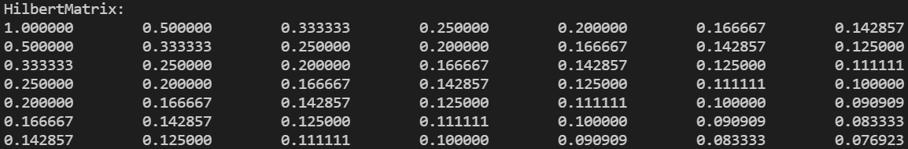
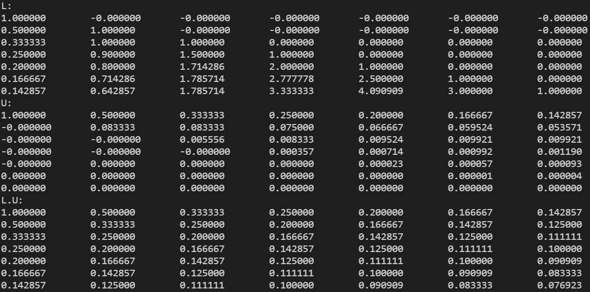
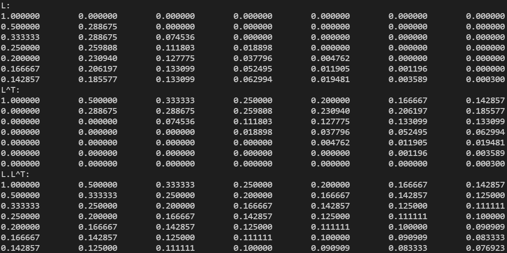
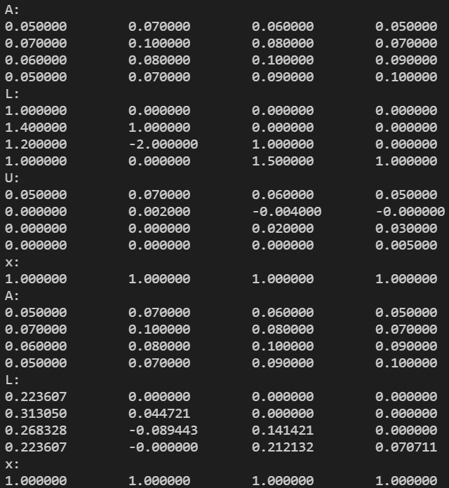

# 数值代数实验报告（Lab #3）

## 问题 1

> Write the procedures that implement the general LU and Cholesky factorizations. Test your routines on some Hilbert matrices $H=(h_{ij})$ whose elements are $h_{ij}=\frac{1}{i+j-1}$.
>
> Produce the Doolittle’s and Cholesky factorizations for a Hilbert matrix with dimension $n=7$ . Please report your factorizations and check numerically whether they are correct (i.e., check whether $H = LU$ and $H = LL^T$ ?).

### 编程结果如下：

用 lab3-1 程序编程，计算 Hilbert 方阵的 Doolittle 分解与 Cholesky 分解，用双精度得到结果如下：

Doolittle 分解：

Cholesky 分解：

### 结果分析 ：

$LU=H$ 成立，LU 分解结果正确

$LL^T=H$ 成立，Cholesky 分解结果正确

## 问题 2

> Use the procedures you developed to solve the following system by both the LU (Doolittle’s) method and the Cholesky method (Please report both your factorizations and numerical solutions), give a summary in your report:
> $$
> \left\{ {\begin{array}{c}
>   {0.05{x_1} + 0.07{x_2} + 0.06{x_3} + 0.05{x_4} = 0.23} \\ 
>   {0.07{x_1} + 0.10{x_2} + 0.08{x_3} + 0.07{x_4} = 0.32} \\ 
>   {0.06{x_1} + 0.08{x_2} + 0.10{x_3} + 0.09{x_4} = 0.33} \\ 
>   {0.05{x_1} + 0.07{x_2} + 0.09{x_3} + 0.10{x_4} = 0.31} 
> \end{array}} \right.
> $$

### 编程计算结果如下：

用 lab3-2 程序编程利用 LU 分解和 Cholosky 分解计算，计算结果保留 7 位有效数字（即 6 位小数），用双精度得到结果如下：

### 结果分析：

原方程的解为 $(1,1,1,1)^T$ ，与利用 LU 分解和 Cholosky 分解计算得到结果一致，说明算法的正确性。

## 总结与体会

1. LU分解是最常见的求解线性系统 $Ax=b$ 的方法
2. Cholesky分解需要矩阵为对称正定矩阵，但是数值稳定的