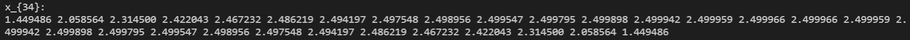
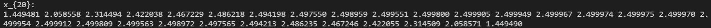

# 数值代数实验报告（Lab #4）

迭代法解线性代数方程组

## 问题 1

> 1. 分别编写Jacobi迭代及Gauss-Seidel迭代的通用程序；【提示：利用迭代的分量形式。不容许对矩阵求逆！！】
>
> 2. 分别用如上程序求下述方程组的解，请输出各自的迭代步数及数值解。
>
>    设有线性方程组 $Ax=b$ ，其中
>    $$
>    A=\begin{pmatrix}
>    2.8 & -1 \\
>    -1 & 2.8 & -1 \\
>    & \ddots & \ddots & \ddots \\
>    & & -1 & 2.8 & -1 \\
>    & & & -1 & 2.8
>    \end{pmatrix}_{30 \times 30},
>    b=\begin{pmatrix}
>    2 \\
>    2 \\
>    \vdots \\
>    2 \\
>    2
>    \end{pmatrix}_{30 \times 1}
>    $$
>    
>
> 3. 取初值迭代 $x^{(0)}=(0, 0, \dots, 0)^T$ ，停止条件：$\Vert x^{(k+1)} - x^{(k)} \Vert \le 10^{-5}$
>
> 4. 通过本次数值实验，比较并讨论两种迭代方法的优缺点。

### 编程结果如下：

Jacobi迭代及Gauss-Seidel迭代的通用程序

```c
double Jacobi(double *A, double *x, double *b, unsigned n);
double Gauss_Seidel(double *A, double *x, double *b, unsigned n);
```

用 lab4-1 程序（利用双精度浮点数，即 double 型）计算Jacobi迭代及Gauss-Seidel迭代，取初值迭代 $x^{(0)}=(0, 0, \dots, 0)^T$ ，停止条件：$\Vert x^{(k+1)} - x^{(k)} \Vert \le 10^{-5}$，计算结果均采用科学计数法保留 6 位小数，解方程得到结果如下：

Jacobi迭代：
$$
x_{34}=(
1.449486,2.058564,2.314500,2.422043,2.467232,\\
2.486219,2.494197,2.497548,2.498956,2.499547,\\
2.499795,2.499898,2.499942,2.499959,2.499966,\\
2.499966,2.499959,2.499942,2.499898,2.499795,\\
2.499547,2.498956,2.497548,2.494197,2.486219,\\
2.467232,2.422043,2.314500,2.058564,1.449486)
$$


Gauss-Seidel迭代：
$$
x_{20}=(
1.449481,2.058558,2.314494,2.422038,2.467229,\\
2.486218,2.494198,2.497550,2.498959,2.499551,\\
2.499800,2.499905,2.499949,2.499967,2.499974,\\
2.499975,2.499970,2.499954,2.499912,2.499809,\\
2.499563,2.498972,2.497565,2.494213,2.486235,\\
2.467246,2.422055,2.314509,2.058571,1.449490)
$$


### 结果分析：

在初值和停止条件相同的情况下：

Jacobi 迭代步数较多，收敛速度较慢；

Gauss-Seidel 迭代步数较少，收敛速度较快。