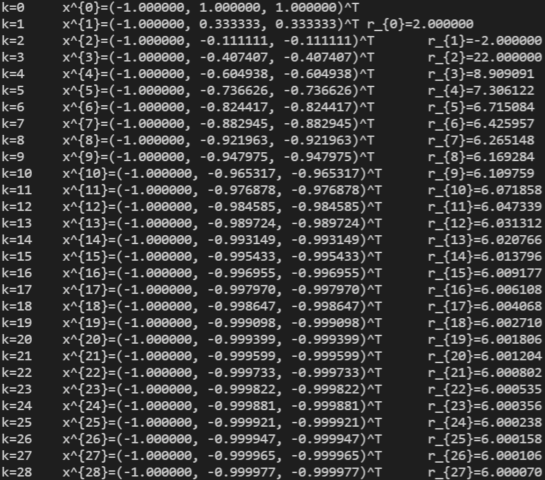
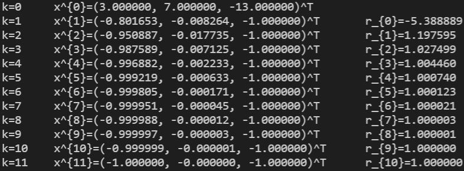
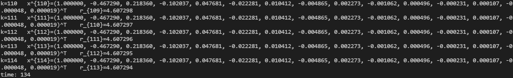
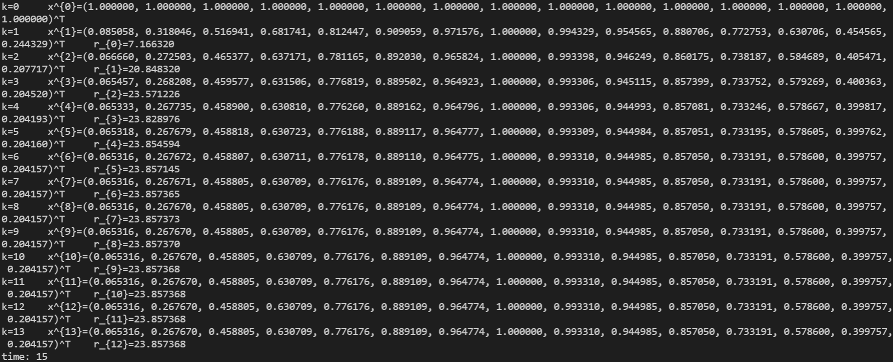

# 数值代数实验报告（Lab #5）

归一化幂法及逆幂法

## 问题 1

> 1. 分别编写归一化幂法与归一化逆幂法的一般程序；
>    
>    【提示：逆幂法迭代时，要充分利用Lab3中的LU分解程序,先对目标矩阵A进行LU分解，再求解下三角和上三角方程组。不容许对矩阵求逆！】
>    
> 2. 分别用如上程序验证课本第5章5.1节中的例1（参见259页）和例2（参见261页）。你的泛函比值 $r_k$ 的计算公式以及计算结果是否与例题计算结果一致？
>
>    如果不一致，请指出不一致的地方（需指出例题解答中的错误之处）；
>
> 3. 分别用如上程序求下述三对角方阵的最大模特征值和最小模特征值。初值向量见后，记泛函比值为 $r_k$ （线性泛函可自行设定），迭代停止条件为 $\Vert x^{(k+1)} - x^{(k)} \Vert \le 10^{-10}$。
>
>    请输出主（最小模）特征值及相应的特征向量，迭代步数及算法的总运行时间。
>    $$
>    A=\begin{pmatrix}
>    4.14 & -1 \\
>    -1 & 2 & -1 \\
>    & \ddots & \ddots & \ddots \\
>    & & -1 & 2 & -1 \\
>    & & & -1 & 2
>    \end{pmatrix}_{15 \times 15},
>    x^{(0)}=\begin{pmatrix}
>    1 \\
>    1 \\
>    \vdots \\
>    1 \\
>    1
>    \end{pmatrix}_{15 \times 1}
>    $$
>
> 4. 结合本次数值实验，当矩阵阶数很大时，你觉得哪种算法会更加费时费(算)力？请给出你的理由，并对本次实验作适当的小结。

### 编程结果如下：

归一化幂法与归一化逆幂法的一般程序

```c
double PowerMethod(double *A, double **x, double phi(double *, unsigned), unsigned n, double *r);
double InversePowerMethodDoolittle(double *L, double *U, double **x, double phi(double *, unsigned), unsigned n, double *r);
```

用 lab5-1 程序（利用双精度浮点数，即 double 型）计算最大模特征值和最小模特征值，计算结果均采用保留 6 位小数，得到结果如下：

**例1**：对矩阵 $A=\begin{bmatrix}6&5&-5\\2&6&-2\\2&5&-1\end{bmatrix}$ 和初值向量 $x=(-1, 1, 1)^T$ 使用幂法，停止条件：$\Vert x^{(k+1)} - x^{(k)} \Vert \le 10^{-5}$，计算结果均采用保留 6 位小数.

| $k=0$  | $x^{0}=(-1.000000, 1.000000, 1.000000)^T$    |                   |
| ------ | -------------------------------------------- | ----------------- |
| $k=1$  | $x^{1}=(-1.000000, 0.333333, 0.333333)^T$    | $r_{0}=2.000000$  |
| $k=2$  | $x^{2}=(-1.000000, -0.111111, -0.111111)^T$  | $r_{1}=-2.000000$ |
| $k=3$  | $x^{3}=(-1.000000, -0.407407, -0.407407)^T$  | $r_{2}=22.000000$ |
| $k=4$  | $x^{4}=(-1.000000, -0.604938, -0.604938)^T$  | $r_{3}=8.909091$  |
| $k=5$  | $x^{5}=(-1.000000, -0.736626, -0.736626)^T$  | $r_{4}=7.306122$  |
| $k=6$  | $x^{6}=(-1.000000, -0.824417, -0.824417)^T$  | $r_{5}=6.715084$  |
| $k=7$  | $x^{7}=(-1.000000, -0.882945, -0.882945)^T$  | $r_{6}=6.425957$  |
| $k=8$  | $x^{8}=(-1.000000, -0.921963, -0.921963)^T$  | $r_{7}=6.265148$  |
| $k=9$  | $x^{9}=(-1.000000, -0.947975, -0.947975)^T$  | $r_{8}=6.169284$  |
| $k=10$ | $x^{10}=(-1.000000, -0.965317, -0.965317)^T$ | $r_{9}=6.109759$  |
| $k=11$ | $x^{11}=(-1.000000, -0.976878, -0.976878)^T$ | $r_{10}=6.071858$ |
| $k=12$ | $x^{12}=(-1.000000, -0.984585, -0.984585)^T$ | $r_{11}=6.047339$ |
| $k=13$ | $x^{13}=(-1.000000, -0.989724, -0.989724)^T$ | $r_{12}=6.031312$ |
| $k=14$ | $x^{14}=(-1.000000, -0.993149, -0.993149)^T$ | $r_{13}=6.020766$ |
| $k=15$ | $x^{15}=(-1.000000, -0.995433, -0.995433)^T$ | $r_{14}=6.013796$ |
| $k=16$ | $x^{16}=(-1.000000, -0.996955, -0.996955)^T$ | $r_{15}=6.009177$ |
| $k=17$ | $x^{17}=(-1.000000, -0.997970, -0.997970)^T$ | $r_{16}=6.006108$ |
| $k=18$ | $x^{18}=(-1.000000, -0.998647, -0.998647)^T$ | $r_{17}=6.004068$ |
| $k=19$ | $x^{19}=(-1.000000, -0.999098, -0.999098)^T$ | $r_{18}=6.002710$ |
| $k=20$ | $x^{20}=(-1.000000, -0.999399, -0.999399)^T$ | $r_{19}=6.001806$ |
| $k=21$ | $x^{21}=(-1.000000, -0.999599, -0.999599)^T$ | $r_{20}=6.001204$ |
| $k=22$ | $x^{22}=(-1.000000, -0.999733, -0.999733)^T$ | $r_{21}=6.000802$ |
| $k=23$ | $x^{23}=(-1.000000, -0.999822, -0.999822)^T$ | $r_{22}=6.000535$ |
| $k=24$ | $x^{24}=(-1.000000, -0.999881, -0.999881)^T$ | $r_{23}=6.000356$ |
| $k=25$ | $x^{25}=(-1.000000, -0.999921, -0.999921)^T$ | $r_{24}=6.000238$ |
| $k=26$ | $x^{26}=(-1.000000, -0.999947, -0.999947)^T$ | $r_{25}=6.000158$ |
| $k=27$ | $x^{27}=(-1.000000, -0.999965, -0.999965)^T$ | $r_{26}=6.000106$ |
| $k=28$ | $x^{28}=(-1.000000, -0.999977, -0.999977)^T$ | $r_{27}=6.000070$ |

$A$ 的主特征值是 $6$ ，而一个特征向量是 $(1, 1, 1)^T$ .



**例2**：用例1中的矩阵说明逆幂法. 它的LU分解是
$$
\begin{bmatrix}6&5&-5\\2&6&-2\\2&5&-1\end{bmatrix}=
\begin{bmatrix}1&0&0\\\frac{1}{3}&1&0\\\frac{1}{3}&\frac{10}{13}&1\end{bmatrix}
\begin{bmatrix}6&5&-5\\0&\frac{13}{3}&-\frac{1}{3}\\0&0&\frac{12}{13}\end{bmatrix}
$$

| $k=0$  | $x^{0}=(3.000000, 7.000000, -13.000000)^T$   |                   |
| ------ | -------------------------------------------- | ----------------- |
| $k=1$  | $x^{1}=(-0.801653, -0.008264, -1.000000)^T$  | $r_{0}=-5.388889$ |
| $k=2$  | $x^{2}=(-0.950887, -0.017735, -1.000000)^T$  | $r_{1}=1.197595$  |
| $k=3$  | $x^{3}=(-0.987589, -0.007125, -1.000000)^T$  | $r_{2}=1.027499$  |
| $k=4$  | $x^{4}=(-0.996882, -0.002233, -1.000000)^T$  | $r_{3}=1.004460$  |
| $k=5$  | $x^{5}=(-0.999219, -0.000633, -1.000000)^T$  | $r_{4}=1.000740$  |
| $k=6$  | $x^{6}=(-0.999805, -0.000171, -1.000000)^T$  | $r_{5}=1.000123$  |
| $k=7$  | $x^{7}=(-0.999951, -0.000045, -1.000000)^T$  | $r_{6}=1.000021$  |
| $k=8$  | $x^{8}=(-0.999988, -0.000012, -1.000000)^T$  | $r_{7}=1.000003$  |
| $k=9$  | $x^{9}=(-0.999997, -0.000003, -1.000000)^T$  | $r_{8}=1.000001$  |
| $k=10$ | $x^{10}=(-0.999999, -0.000001, -1.000000)^T$ | $r_{9}=1.000000$  |
| $k=11$ | $x^{11}=(-1.000000, -0.000000, -1.000000)^T$ | $r_{10}=1.000000$ |

$r_{0}$ 计算结果与例题计算结果不一致，例题解答中 $r_{0}=-5.8889$ 错误.



**求最大模特征值和最小模特征值**：初值向量见后，记泛函比值为 $r_k$ （线性泛函可自行设定），迭代停止条件为 $\Vert x^{(k+1)} - x^{(k)} \Vert \le 10^{-10}$。

| $k=0$    | $x^{0}=(1, 1, 1, 1, 1, 1, 1, 1, 1, 1, 1, 1, 1, 1, 1)^T$      |                    |
| -------- | ------------------------------------------------------------ | ------------------ |
| $k=1$    | $x^{1}=(1.000000, 0.000000, 0.000000, 0.000000, 0.000000, 0.000000, 0.000000, 0.000000, 0.000000, 0.000000, 0.000000, 0.000000, 0.000000, 0.000000, 0.318471)^T$ | $r_{0}=1.000000$   |
| $k=2$    | $x^{2}=(1.000000, -0.241546, 0.000000, 0.000000, 0.000000, 0.000000, 0.000000, 0.000000, 0.000000, 0.000000, 0.000000, 0.000000, 0.000000, -0.076925, 0.153851)^T$ | $r_{1}=2.000000$   |
| $k=3$    | $x^{3}=(1.000000, -0.338486, 0.055128, 0.000000, 0.000000, 0.000000, 0.000000, 0.000000, 0.000000, 0.000000, 0.000000, 0.000000, 0.017557, -0.070227, 0.087783)^T$ | $r_{2}=2.500000$   |
| $k=4$    | $x^{4}=(1.000000, -0.386760, 0.100199, -0.012310, 0.000000, 0.000000, 0.000000, 0.000000, 0.000000, 0.000000, 0.000000, -0.003920, 0.023521, -0.054883, 0.054883)^T$ | $r_{3}=2.800000$   |
| $k=5$    | $x^{5}=(1.000000, -0.413921, 0.132428, -0.027573, 0.002719, 0.000000, 0.000000, 0.000000, 0.000000, 0.000000, 0.000866, -0.006928, 0.023382, -0.041569, 0.036373)^T$ | $r_{4}=3.000000$   |
| $k=6$    | $x^{6}=(1.000000, -0.430457, 0.155108, -0.041787, 0.007249, -0.000597, 0.000000, 0.000000, 0.000000, -0.000190, 0.001902, -0.008367, 0.020919, -0.031378, 0.025102)^T$ | $r_{5}=3.142857$   |
| $k=7$    | $x^{7}=(1.000000, -0.441099, 0.171200, -0.053809, 0.012446, -0.001847, 0.000131, 0.000000, 0.000042, -0.000499, 0.002705, -0.008655, 0.017850, -0.023800, 0.017850)^T$ | $r_{6}=3.250000$   |
| $k=8$    | $x^{8}=(1.000000, -0.448232, 0.182774, -0.063579, 0.017583, -0.003552, 0.000460, -0.000038, 0.000127, -0.000817, 0.003179, -0.008265, 0.014877, -0.018183, 0.012988)^T$ | $r_{7}=3.333333$   |
| $k=9$    | $x^{9}=(1.000000, -0.453168, 0.191220, -0.071382, 0.022295, -0.005481, 0.000983, -0.000144, 0.000242, -0.001077, 0.003365, -0.007538, 0.012249, -0.013999, 0.009625)^T$ | $r_{8}=3.400000$   |
| $k=10$   | $x^{10}=(1.000000, -0.456669, 0.197465, -0.077567, 0.026442, -0.007454, 0.001653, -0.000330, 0.000371, -0.001254, 0.003341, -0.006682, 0.010023, -0.010858, 0.007239)^T$ | $r_{9}=3.454545$   |
| $\cdots$ | $\cdots$                                                     | $\cdots$           |
| $k=111$  | $x^{111}=(1.000000, -0.467290, 0.218360, -0.102037, 0.047681, -0.022281, 0.010412, -0.004865, 0.002273, -0.001062, 0.000496, -0.000231, 0.000107, -0.000048, 0.000019)^T$ | $r_{110}=4.607297$ |
| $k=112$  | $x^{112}=(1.000000, -0.467290, 0.218360, -0.102037, 0.047681, -0.022281, 0.010412, -0.004865, 0.002273, -0.001062, 0.000496, -0.000231, 0.000107, -0.000048, 0.000019)^T$ | $r_{111}=4.607296$ |
| $k=113$  | $x^{113}=(1.000000, -0.467290, 0.218360, -0.102037, 0.047681, -0.022281, 0.010412, -0.004865, 0.002273, -0.001062, 0.000496, -0.000231, 0.000107, -0.000048, 0.000019)^T$ | $r_{112}=4.607295$ |
| $k=114$  | $x^{114}=(1.000000, -0.467290, 0.218360, -0.102037, 0.047681, -0.022281, 0.010412, -0.004865, 0.002273, -0.001062, 0.000496, -0.000231, 0.000107, -0.000048, 0.000019)^T$ | $r_{113}=4.607294$ |

最大模特征值 $4.607294$ ，相应的特征向量
$$
(1.000000, -0.467290, 0.218360, -0.102037, 0.047681, -0.022281, 0.010412, -0.004865,\\ 0.002273, -0.001062, 0.000496, -0.000231, 0.000107, -0.000048, 0.000019)^T
$$
算法的总运行时间： $134$ .



| $k=0$  | $x^{0}=(1, 1, 1, 1, 1, 1, 1, 1, 1, 1, 1, 1, 1, 1, 1)^T$      |                    |
| ------ | ------------------------------------------------------------ | ------------------ |
| $k=1$  | $x^{1}=(0.085058, 0.318046, 0.516941, 0.681741, 0.812447, 0.909059, 0.971576, 1.000000, 0.994329, 0.954565, 0.880706, 0.772753, 0.630706, 0.454565, 0.244329)^T$ | $r_{0}=2.494802$   |
| $k=2$  | $x^{2}=(0.066660, 0.272503, 0.465377, 0.637171, 0.781165, 0.892030, 0.965824, 1.000000, 0.993398, 0.946249, 0.860175, 0.738187, 0.584689, 0.405471, 0.207717)^T$ | $r_{1}=19.218642$  |
| $k=3$  | $x^{3}=(0.065457, 0.268208, 0.459577, 0.631506, 0.776819, 0.889502, 0.964923, 1.000000, 0.993306, 0.945115, 0.857399, 0.733752, 0.579269, 0.400363, 0.204520)^T$ | $r_{2}=23.507848$  |
| $k=4$  | $x^{4}=(0.065333, 0.267735, 0.458900, 0.630810, 0.776260, 0.889162, 0.964796, 1.000000, 0.993306, 0.944993, 0.857081, 0.733246, 0.578667, 0.399817, 0.204193)^T$ | $r_{3}=23.821731$  |
| $k=5$  | $x^{5}=(0.065318, 0.267679, 0.458818, 0.630723, 0.776188, 0.889117, 0.964777, 1.000000, 0.993309, 0.944984, 0.857051, 0.733195, 0.578605, 0.399762, 0.204160)^T$ | $r_{4}=23.853117$  |
| $k=6$  | $x^{6}=(0.065316, 0.267672, 0.458807, 0.630711, 0.776178, 0.889110, 0.964775, 1.000000, 0.993310, 0.944985, 0.857050, 0.733191, 0.578600, 0.399757, 0.204157)^T$ | $r_{5}=23.856798$  |
| $k=7$  | $x^{7}=(0.065316, 0.267671, 0.458805, 0.630709, 0.776176, 0.889109, 0.964774, 1.000000, 0.993310, 0.944985, 0.857050, 0.733191, 0.578600, 0.399757, 0.204157)^T$ | $r_{6}=23.857280$  |
| $k=8$  | $x^{8}=(0.065316, 0.267670, 0.458805, 0.630709, 0.776176, 0.889109, 0.964774, 1.000000, 0.993310, 0.944985, 0.857050, 0.733191, 0.578600, 0.399757, 0.204157)^T$ | $r_{7}=23.857352$  |
| $k=9$  | $x^{9}=(0.065316, 0.267670, 0.458805, 0.630709, 0.776176, 0.889109, 0.964774, 1.000000, 0.993310, 0.944985, 0.857050, 0.733191, 0.578600, 0.399757, 0.204157)^T$ | $r_{8}=23.857365$  |
| $k=10$ | $x^{10}=(0.065316, 0.267670, 0.458805, 0.630709, 0.776176, 0.889109, 0.964774, 1.000000, 0.993310, 0.944985, 0.857050, 0.733191, 0.578600, 0.399757, 0.204157)^T$ | $r_{9}=23.857367$  |
| $k=11$ | $x^{11}=(0.065316, 0.267670, 0.458805, 0.630709, 0.776176, 0.889109, 0.964774, 1.000000, 0.993310, 0.944985, 0.857050, 0.733191, 0.578600, 0.399757, 0.204157)^T$ | $r_{10}=23.857368$ |
| $k=12$ | $x^{12}=(0.065316, 0.267670, 0.458805, 0.630709, 0.776176, 0.889109, 0.964774, 1.000000, 0.993310, 0.944985, 0.857050, 0.733191, 0.578600, 0.399757, 0.204157)^T$ | $r_{11}=23.857368$ |
| $k=13$ | $x^{13}=(0.065316, 0.267670, 0.458805, 0.630709, 0.776176, 0.889109, 0.964774, 1.000000, 0.993310, 0.944985, 0.857050, 0.733191, 0.578600, 0.399757, 0.204157)^T$ | $r_{12}=23.857368$ |

最小模特征值 $23.857368^{-1}=0.0419158$ ，相应的特征向量
$$
(0.065316, 0.267670, 0.458805, 0.630709, 0.776176, 0.889109, 0.964774, 1.000000,\\ 0.993310, 0.944985, 0.857050, 0.733191, 0.578600, 0.399757, 0.204157)^T
$$
算法的总运行时间： $15$ .



### 结果分析：

结合本次数值实验，以上结果表明：幂法总运行时间比逆幂法多很多，但单次迭代运行时间与逆幂法相近。

结合本次数值实验，当矩阵阶数很大时，我觉得逆幂法算法会更加费时费(算)力.
理由是幂法涉及矩阵乘法 $T(n)=O(n^2)$；逆幂法在用 LU 分解解方程，求 $L, U$ 矩阵 $T(n)=O(n^3)$，解方程 $T(n)=O(n^2)$，当阶数较大时时间复杂度较高。